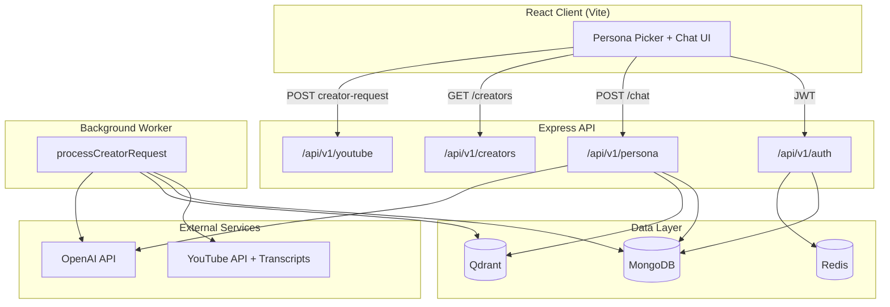
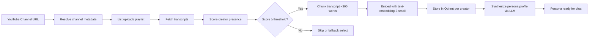
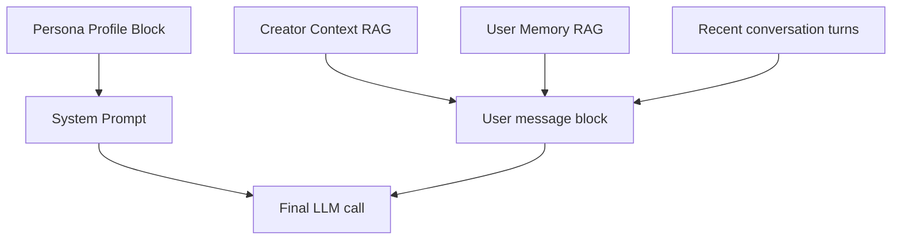
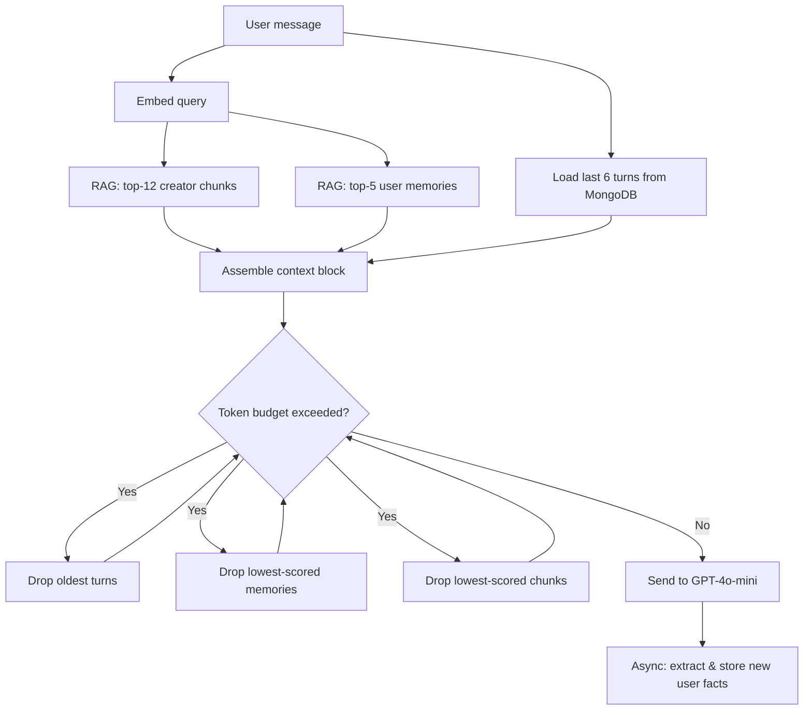

# Persona AI

A fan-made AI persona chat platform built from public YouTube content. Talk to **any YouTube creator** whose channel has captions — the system ingests transcripts, builds a vector-backed persona, and lets you chat in their voice.

**Demo personas:** [Hitesh Choudhary](https://www.youtube.com/@HiteshChoudhary) and [Piyush Garg](https://www.youtube.com/@Chaicode) are pre-ingested and pinned for instant access. You can also add any other creator from the UI.

---

## Links

| Resource | URL |
|----------|-----|
| **Live demo** | [persona-agent.aritro.me](https://persona-agent.aritro.me/) |
| **GitHub** | [github.com/arrxy/persona-agent](https://github.com/arrxy/persona-agent) |

> **Disclaimer:** All personas are AI-generated from public YouTube transcripts. They are not the real creators.

---

## Features

- **Any YouTube creator** — paste a channel URL; a background worker ingests transcripts and builds a chat-ready persona
- **Pinned demo personas** — switch instantly between Hitesh Choudhary and Piyush Garg from the persona picker
- **RAG-backed answers** — responses grounded in retrieved video transcript chunks with source citations
- **Cross-session memory** — remembers user preferences and context per creator
- **Normal & Sarcastic modes** — toggle tone without leaving the chat
- **Language-aware replies** — matches each creator's dialect (English, Hinglish in Roman script, Hindi)
- **Google OAuth** — sign in and resume conversations from the sidebar

---

## System Architecture



**Request flow:** `src/server.ts` connects MongoDB and Redis, then starts `src/app.ts`. Routes are mounted under `/api/v1/{auth,persona,creators,youtube,agent}`. The React client is served as static files from `client/dist` in production, or via Vite dev server with an `/api` proxy locally.

---

## How Persona Data Is Collected & Prepared

The pipeline is **creator-agnostic** — the same flow runs for Hitesh, Piyush, or any channel you submit.

### Ingestion pipeline



### Step-by-step

1. **Channel discovery** — YouTube Data API resolves channel ID, handle, avatar, and uploads playlist (`src/service/youtube/channel.ts`).
2. **Video listing** — Up to 150 uploads fetched, ranked by views + duration (`TOP_VIEWS_LONGEST` strategy), with recent uploads merged in.
3. **Transcript fetch** — Captions pulled via `youtube-transcript` (public captions only). No manual script download.
4. **Creator-presence scoring** — Each video is scored on:
   - Name/handle mentions in the transcript
   - First-person speech (`I`, `my`, `मैं`, `मेरा`, etc.)
   - Hindi vs English weighting (Hindi transcripts weight first-person more heavily)
   - Threshold: `PRESENCE_THRESHOLD=0.35` — filters collabs and off-topic uploads
5. **Volume target** — Ingest until ~**20 hours** of selected transcript content is collected.
6. **Chunking** — Segments merged into ~300-word chunks with timestamps preserved (`src/service/chunking.ts`).
7. **Embedding** — `text-embedding-3-small` (1536 dims) stored in a dedicated Qdrant collection per creator (`src/service/ingestion/embedVideo.ts`).
8. **Persona profile synthesis** — GPT analyzes the top 24 transcript chunks (~12k chars) and extracts speaking style, recurring opinions, core topics, and behavioral do/don't rules (`src/service/ingestion/personaProfile.ts`).

If no videos pass the presence threshold, a fallback selects the top-viewed videos with available transcripts.

### Adding a new creator

From the UI: click **+ Create persona**, paste any YouTube channel URL (e.g. `https://www.youtube.com/@SomeCreator`). A background worker processes the request (typically within 24–48 hours depending on channel size). Once complete, the creator appears in the explore list and is ready to chat.

Via API:

```bash
POST /api/v1/youtube/creator-requests
Authorization: Bearer <access_token>
Content-Type: application/json

{ "channelUrl": "https://www.youtube.com/@SomeCreator" }
```

### Pinning creators (optional)

Mark any ingested creator as pinned in MongoDB to surface them at the top of the picker (max 3):

```js
db.creators.updateOne(
  { handle: "HiteshChoudhary" },
  { $set: { isPinned: true, pinnedOrder: 0 } }
)
db.creators.updateOne(
  { handle: "Chaicode" },
  { $set: { isPinned: true, pinnedOrder: 1 } }
)
```

---

## Prompt Engineering Strategy

Prompts are assembled in layers inside `src/service/persona/buildContext.ts`:



### 1. System prompt (identity & guardrails)

- Declares a **fan-made AI persona** with mandatory disclosure
- Forces **first-person voice** — forbids third-person phrasing like `"Hitesh would say"` or `"they would"`
- Injects **language rules** per creator via `src/service/persona/language.ts`:
  - **English** — match how the creator speaks in English videos; never switch to match the user's language
  - **Hinglish** — natural Hindi-English mix in Roman script only (never Devanagari)
  - **Hindi** — Hindi vocabulary in Roman transliteration
- Mode-specific instructions:
  - **Normal (`chat`)** — helpful, conversational, teacher-like (`temperature: 0.7`)
  - **Sarcastic** — blunt, roast-y, strong opinions grounded in context; no generic snark bot (`temperature: 0.95`)

### 2. Persona profile block (style compression)

A pre-computed profile from ingestion is injected as a compact summary:

```
PERSONA PROFILE (synthesized from 18.4h of videos):
Tone: direct, encouraging, practical.
Common phrases: "dekho", "simple si baat hai", ...
Recurring opinions:
- React vs Angular: prefers React for job market ...
```

This keeps voice consistent even when RAG retrieval is weak on a niche question.

### 3. RAG context (grounding)

Retrieved transcript chunks are formatted as:

```
CREATOR CONTEXT (from videos):
- [Video Title] transcript excerpt... (https://youtube.com/...)
```

Hard rules enforced in the system prompt:

- Do **not** invent quotes, specs, release dates, or product facts
- If context is thin → say you haven't covered that topic enough — don't guess

### 4. User memory context (personalization)

Facts extracted after each exchange (e.g. *"User is learning React"*, *"User owns a MacBook M2"*) are retrieved semantically and injected as `USER CONTEXT`.

Each assistant message stores `promptVersion` (`persona-chat-v3` or `persona-chat-v3-sarcastic`) and retrieval metadata for reproducibility.

---

## Context Management



| Layer | Source | Default limit | Min retained |
|-------|--------|---------------|--------------|
| Creator RAG | Qdrant (cosine similarity) | 12 chunks, score ≥ 0.72 | 4 chunks |
| User memory | Qdrant (scoped per user + creator) | 5 facts | 1 fact |
| Session history | MongoDB `Message` collection | 6 turns (12 messages) | 2 turns |
| Token budget | Estimated char/4 | ~10,000 tokens | — |

**Trimming order** when over budget: recent turns → memories → RAG chunks (minimum floors prevent empty context).

**Post-reply memory** (`src/service/memory/extract.ts`):

- Separate LLM call extracts durable user facts after each exchange
- Deduplication via embedding similarity (≥ 0.85 = skip duplicate)
- Cap of 200 memories per user+creator scope; oldest evicted when full

**Reply language inference:** Language is inferred from retrieved chunk languages and scores, not from the user's message — so Hitesh stays in Hinglish even if you ask in English.

---

## Sample Conversations

### Hitesh Choudhary — Normal mode

**User:** Should I learn JavaScript or Python first as a complete beginner?

**Hitesh:** Dekho, simple si baat hai — agar tumhe web development me interest hai, JavaScript se start karo. Browser me directly run hoti hai, instant feedback milta hai, aur React/Node dono ek hi language se cover ho jaate hain. Python achhi hai agar tum data science ya backend scripting ki taraf jaa rahe ho, but job market me web stack ke liye JS zyada common hai. Maine apne courses me hamesha projects pe focus kiya hai — language se zyada important hai ki tum kuch build kar rahe ho daily.

---

**User:** What's your take on using AI to write code?

**Hitesh:** AI ek tool hai, replacement nahi. Main use karta hoon boilerplate ke liye, documentation samajhne ke liye — but agar tum fundamentals nahi samjhte aur blindly copy-paste kar rahe ho, interview me pakde jaoge. Pehle khud likho, phir AI se compare karo. Wahi approach main videos me recommend karta hoon.

---

### Piyush Garg — Normal mode

**User:** MERN ya Next.js — kya seekhu 2025 me?

**Piyush:** Honestly, agar tum fresh ho to MERN se start karo — concepts clear honge. Next.js tab add karo jab React comfortable ho jaye. Maine dekha hai log directly Next pe jump karte hain aur SSR/SSG confuse ho jaata hai. MERN se tum full stack samajhoge, phir Next.js migration easy lagegi. Job postings me dono demand me hain, but foundation weak hogi to koi bhi stack kaam nahi karega.

---

### Piyush Garg — Sarcastic mode

**User:** Is LeetCode grinding still worth it?

**Piyush:** Haan bilkul - agar tumhe pasand hai 500th time "two sum" dekhna aur pretend karna ki ye real job hai. Look, DSA important hai, but 800 problems karke ego boost karna aur system design me zero hona — ye wahi trap hai jisme log rehte hain. 150-200 quality problems, patterns samjho, projects banao. Baaki sab LinkedIn cope hai.

---

## User Experience

- **Persona picker** — pinned creators at the top; search and explore any ingested channel
- **Easy switching** — pick a creator to start a new chat; sidebar preserves per-persona history
- **Mode toggle** — Normal / Sarcastic in the chat header
- **Source transparency** — "Show sources (N)" on each reply links to video titles and transcript excerpts
- **Create any persona** — submit a YouTube channel URL from the picker; track ingestion status inline
- **Conversation history** — sidebar lists past chats; click to resume with full context

---

## Tech Stack

| Layer | Technology |
|-------|------------|
| Frontend | React 19, Vite, TypeScript |
| Backend | Express 5, TypeScript (ESM, NodeNext) |
| Database | MongoDB (Mongoose) |
| Vector DB | Qdrant |
| Cache / sessions | Redis |
| LLM | OpenAI GPT-4o-mini |
| Embeddings | text-embedding-3-small (1536 dims) |
| Auth | JWT access tokens + Redis-backed refresh tokens, Google OAuth |
| Env management | `@dotenvx/dotenvx` (encrypted `.env`) |
| Deploy | DigitalOcean App Platform (API + worker), Vercel (client) |

---

## Project Structure

```
persona-ai/
├── client/                     # React SPA
│   └── src/
│       ├── components/         # ChatView, PersonaPicker, Sidebar, AuthPage
│       └── api.ts              # Typed API client
├── src/
│   ├── server.ts               # Entrypoint: DB + Redis + app
│   ├── app.ts                  # Express app, route mounting, static client
│   ├── worker.ts               # Background ingestion worker
│   ├── routes/
│   │   ├── authRouter.ts       # Register, login, Google, refresh
│   │   ├── personaRouter.ts    # Chat, conversations
│   │   ├── creatorsRouter.ts   # List personas, reingest
│   │   └── youtubeRouter.ts    # Creator request queue
│   ├── service/
│   │   ├── persona/
│   │   │   ├── chat.ts         # Orchestrates RAG + LLM call
│   │   │   ├── buildContext.ts # Prompt assembly + token budgeting
│   │   │   └── language.ts     # Hinglish/English dialect rules
│   │   ├── ingestion/
│   │   │   ├── embedVideo.ts   # Chunk + embed + Qdrant upsert
│   │   │   └── personaProfile.ts  # LLM persona synthesis
│   │   ├── qdrant/             # Vector search (creator chunks + user memory)
│   │   ├── memory/             # Extract + search user facts
│   │   └── youtube/            # Channel resolve, video selection, transcripts
│   ├── jobs/
│   │   └── processCreatorRequest.ts  # Full ingestion pipeline
│   ├── models/                 # Creator, CreatorVideo, TranscriptChunk, Message, etc.
│   └── config/                 # env.ts, db.ts, redis.ts, qdrant.ts
├── docker-compose.yml          # Local full stack (api, worker, mongo, redis, qdrant)
└── Dockerfile                  # Production multi-stage build
```

---

## Setup & Run

### Prerequisites

- Node.js ≥ 20.19
- Docker & Docker Compose (recommended for local stack)
- `.env.keys` with `DOTENV_PRIVATE_KEY` (for encrypted `.env`)
- OpenAI API key, Google OAuth client ID, YouTube Data API key

### Option A — Docker Compose (recommended)

```bash
git clone https://github.com/arrxy/persona-agent.git
cd persona-agent

# .env.keys must be in repo root (contains DOTENV_PRIVATE_KEY)
docker compose up --build
```

| Service | URL |
|---------|-----|
| API | http://localhost:3000 |
| MongoDB | localhost:27017 |
| Redis | localhost:6379 |
| Qdrant | localhost:6333 |
| Worker | background (processes creator requests) |

Health check:

```bash
curl http://localhost:3000/health
```

### Option B — Local development

**Terminal 1 — API**

```bash
npm install
npm run dev          # tsx watch src/server.ts → http://localhost:3000
```

**Terminal 2 — Worker** (required for persona ingestion)

```bash
npm run dev:worker   # tsx watch src/worker.ts
```

**Terminal 3 — Client**

```bash
cd client && npm install && npm run dev   # Vite → http://localhost:5173, proxies /api → :3000
```

### Environment variables

Env vars are encrypted via `@dotenvx/dotenvx` — `.env` is checked in (encrypted), `.env.keys` holds the private key and must not be committed.

**Required** (see `src/config/env.ts`):

| Variable | Purpose |
|----------|---------|
| `MONGODB_URI` | MongoDB connection string |
| `REDIS_URL` | Redis for refresh token storage |
| `JWT_SECRET` | Access token signing |
| `JWT_REFRESH_SECRET` | Refresh token signing |
| `GOOGLE_CLIENT_ID` | Google OAuth idToken verification |
| `OPEN_AI_KEY` | Chat, embeddings, persona profile synthesis |
| `YOUTUBE_API_KEY` | Channel and video metadata |

**Optional tuning** (see `.env.docker.example`):

| Variable | Default | Description |
|----------|---------|-------------|
| `PORT` | `3000` | API server port |
| `CHAT_MODEL` | `gpt-4o-mini` | LLM for chat and profile synthesis |
| `EMBEDDING_MODEL` | `text-embedding-3-small` | Embedding model |
| `CHUNK_TARGET_WORDS` | `300` | Transcript chunk size at embed time |
| `CREATOR_RAG_TOP_K` | `12` | Chunks retrieved per chat message |
| `CREATOR_RAG_MIN_SCORE` | `0.72` | Cosine score floor for RAG hits |
| `CHAT_MAX_CONTEXT_TOKENS` | `10000` | Prompt token budget |
| `CHAT_SESSION_TURNS` | `6` | Recent conversation turns in context |
| `USER_MEMORY_TOP_K` | `5` | User facts retrieved per message |
| `PRESENCE_THRESHOLD` | `0.35` | Creator-presence score cutoff for video selection |
| `DEFAULT_SOURCE_VIDEO_LIMIT` | `150` | Max videos listed from a channel |
| `TRANSCRIPT_FETCH_DELAY_MS` | `500` | Delay between YouTube transcript fetches |
| `EMAIL_PASSWORD_AUTH_ENABLED` | `false` | Enable email/password login (default: Google only) |

### Production build

```bash
npm run build:all    # compiles API (tsc) + client (vite build)
npm start            # serves API + static client on :3000
```

Worker in production:

```bash
npm run start:worker          # node dist/worker.js
npm run pm2:worker            # PM2 managed worker (see ecosystem.worker.config.cjs)
```

### Production deployment

- **API + Worker:** DigitalOcean App Platform (see `.do/app.yaml`)
- **Client:** Vercel with `/api` rewrite to DigitalOcean backend (see `client/vercel.json`)

Production secrets: set `DOTENV_PRIVATE_KEY` from `.env.keys` in platform secrets. Encrypted `.env.production` is baked into the Docker image at build time.

---

## API Overview

| Method | Endpoint | Auth | Description |
|--------|----------|------|-------------|
| `POST` | `/api/v1/auth/google` | — | Google sign-in `{ idToken }` |
| `POST` | `/api/v1/auth/refresh` | — | Rotate refresh token |
| `GET` | `/api/v1/creators` | JWT | List pinned + explore personas |
| `GET` | `/api/v1/creators/:id` | JWT | Creator detail |
| `POST` | `/api/v1/persona/chat` | JWT | Send message |
| `GET` | `/api/v1/persona/conversations` | JWT | Chat history |
| `GET` | `/api/v1/persona/conversations/:id/messages` | JWT | Messages for a conversation |
| `DELETE` | `/api/v1/persona/conversations/:id` | JWT | Soft-delete a conversation |
| `POST` | `/api/v1/youtube/creator-requests` | JWT | Queue ingestion for any channel |
| `GET` | `/api/v1/youtube/creator-requests` | JWT | List your creator requests |
| `GET` | `/health` | — | Health check |

**Chat request body:**

```json
{
  "creatorId": "<mongo ObjectId>",
  "message": "Should I learn React or Vue?",
  "conversationId": "<optional, for continuing a chat>",
  "mode": "chat"
}
```

`mode` accepts `"chat"` (default) or `"sarcastic"`.

**Chat response:**

```json
{
  "conversationId": "...",
  "reply": "...",
  "mode": "chat",
  "sources": [
    {
      "type": "transcript",
      "text": "...",
      "videoTitle": "...",
      "videoUrl": "...",
      "score": 0.89
    }
  ]
}
```

---

## Evaluation Alignment

| Criterion | Weight | How we address it |
|-----------|--------|-------------------|
| **Persona accuracy** | 30 | RAG from real transcripts + synthesized persona profile; first-person voice rules; creator-presence video filtering; Hinglish dialect lock |
| **Conversation quality** | 25 | Semantic retrieval, cross-session user memory, session history, anti-hallucination guardrails |
| **Technical implementation** | 25 | Service/repository architecture, versioned prompts, Qdrant RAG, async worker pipeline, retrieval metadata on every message |
| **User experience** | 20 | Persona picker with pinned creators and search, one-click switching, Normal/Sarcastic toggle, source citations, conversation sidebar |

---

## License

ISC
